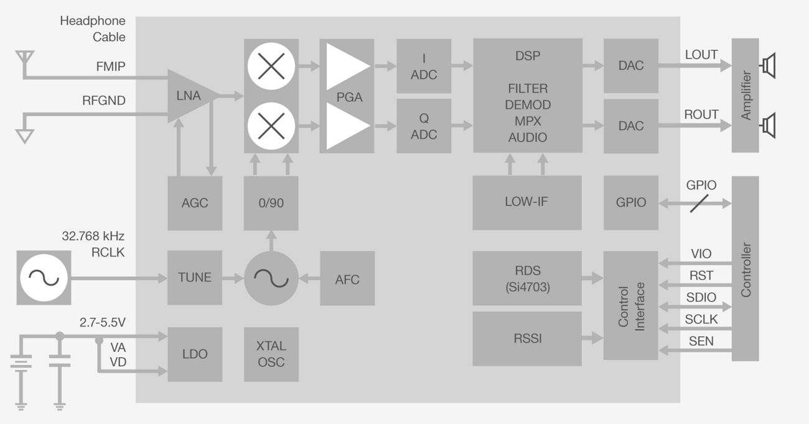

### Silicon Labs Si4703 Arduino Library
========================================

Arduino library to control the Si4703 FM tuner chip. Allows user to tune to different FM stations, read RDS and RBDS information and many other functions.

### Repository Contents
-------------------

* **/examples** - Example sketches for the library (.ino). Run these from the Arduino IDE. 
* **/src** - Source files for the library (.cpp, .h).
* **/docs** - library related documents and data sheets.
* **/img** - images.
* **keywords.txt** - Keywords from this library that will be highlighted in the Arduino IDE. 
* **library.properties** - General library properties for the Arduino package manager. 

For information on installing Arduino libraries, see: http://www.arduino.cc/en/Guide/Libraries

### License Information
-------------------

This product is _**open source**_! 

Distributed as-is; no warranty is given.

### Hardware used:
-----------------------   
 *   1 x SparkFun Breadboard Power Supply Stick - 5V/3.3V (https://www.sparkfun.com/products/13032)
 *   2 x SparkFun Mono Audio Amp Breakout - TPA2005D1     (https://www.sparkfun.com/products/11044)
 *   1 x SparkFun FM Tuner Basic Breakout - Si4703        (https://www.sparkfun.com/products/11083)
 *   1 x Arduino Pro Mini 328 - 3.3V/8MHz                 (https://www.sparkfun.com/products/11114)

-----------------------   

Connections:
-----------------------
### Si4703  → 3.3V A.Pro Mini
-----------------------
- GND     → GND
- 3.3V    → VCC
- SDIO    → A.Pro Mini A4
- SCLK    → A.Pro Mini A5
- SEN     → NC * The breakout board has SEN pulled high
- RST     → A.Pro Mini D4
- GPIO1   → LED2
- GPIO2   → A.Pro Mini D6

-----------------------
### 3.3V A.Pro Mini
-----------------------
- GND     → GND
- VCC     → 3.3V
- A4      → Si4703 SDIO
- A5      → Si4703 SCLK
- D6      → Si4703 GPIO2 
- D2      → Rotary Encoder A
- D3      → Rotary Encoder B
- D4      → Si4703 RST
- D5      → LED1
     
-----------------------
### Rotary Encoder
-----------------------
A  A.Pro Mini D2
B  A.Pro Mini D3
C  GND

-----------------------
### LEDs
-----------------------
- LED1 A      → A.Pro Mini D5 
- LED1 C      → GND
- LED2 A      → Si4703 GPIO1
- LED2 C      → GND

### Description:
-----------------------
This is example code can work with SparkFun FamFM radio kit and breadboard builds as per above connections. 
The used controller is Arduino Pro (3.3V, 8MHz) and has an FTDI header to load Arduino sketches.
The hardware includes the Si4703 FM radio module to find the stations along with audio amps. and speakers for the audio.
The circuit has a rotary encoder to tune the stations. 
The circuit displays the radio station over a serial terminal at 115200 and can be controlled from terminal.
Also it saves the station settings on EEPROM and loads it in subsequent power ups.
 

Operation:
-----------------------
- The board must be powered with a switch mode 9V DC wall wart.
- Each click will increase/decrease station by 0.1MHz or 0.05MHz based in selected FM band range (US/EU, JP Wide, or JP)
- LEDs blink for every step
